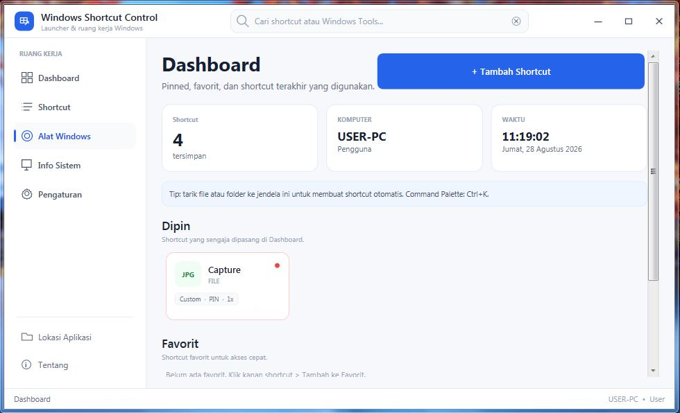
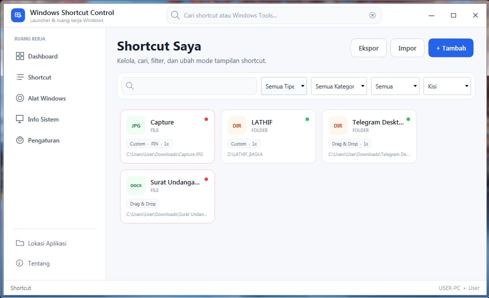
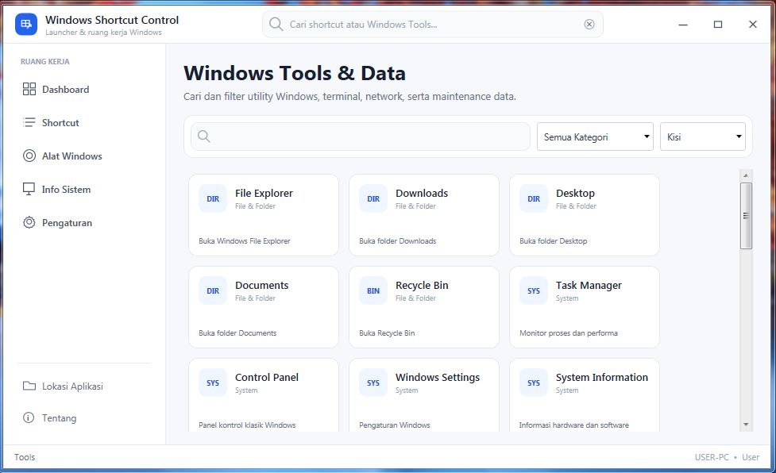
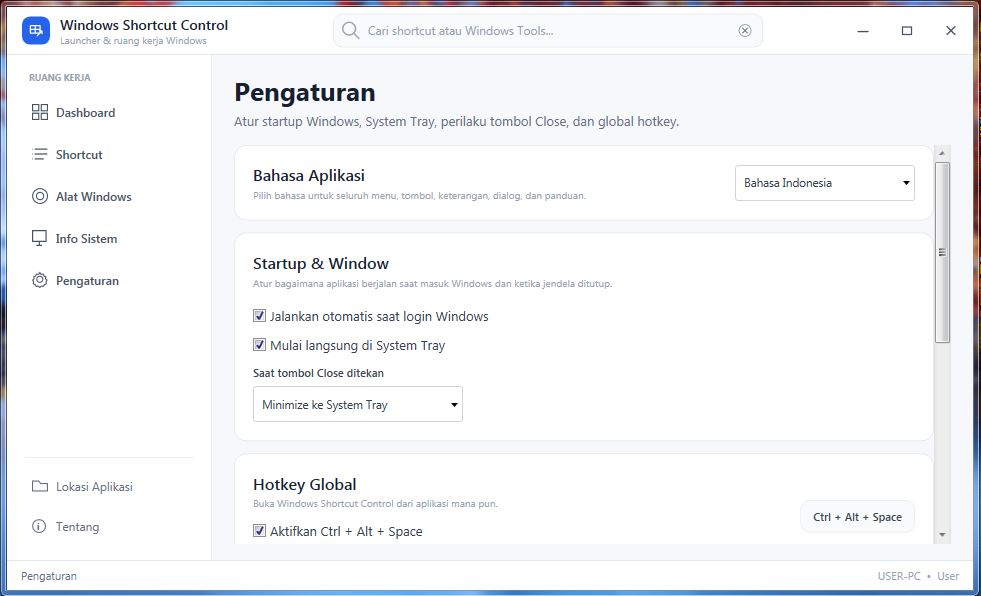
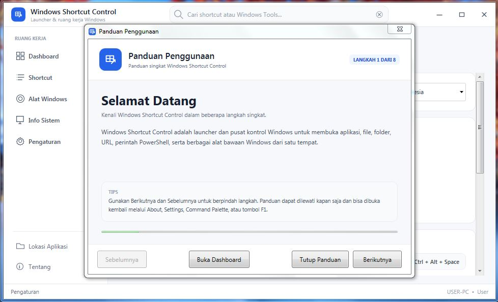

# Screenshots

Visual previews for **Windows Shortcut Control**.

## Dashboard

Main workspace with pinned shortcuts, favorites, recent items, and quick access.

## Shortcut Manager

Manage, search, filter, edit, pin, favorite, duplicate, and launch personal shortcuts.

## Windows Tools

Quick access to built-in Windows administration, system, network, terminal, and recovery tools.

## Settings

Configure startup behavior, System Tray, Close button behavior, language, global hotkey, backup/restore, and diagnostics.

## Built-in Guide

Interactive first-run and on-demand guide for learning the application's menus and controls.

---

### Screenshot Guidelines

When adding new screenshots:

- use descriptive lowercase filenames;
- remove personal paths or private shortcut targets;
- avoid showing tokens, passwords, emails, phone numbers, or private IP addresses;
- keep the application window size consistent when possible;
- prefer JPG/PNG files that remain reasonably small for fast README loading.
